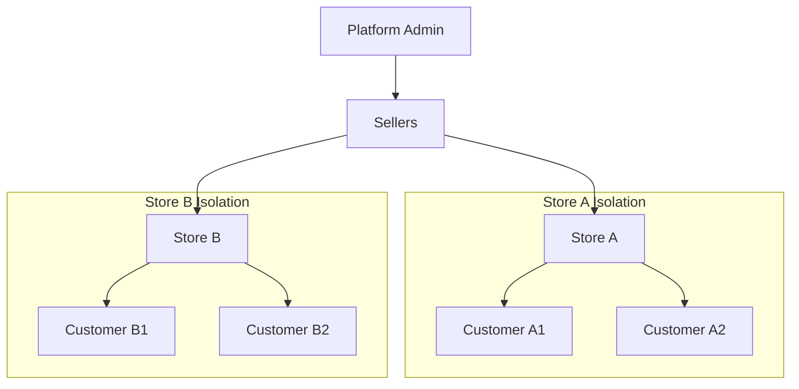

# PLAN-whitelabel-saas (FINAL)

## Goal Description

Implement **Complete Store Isolation** (White-label SaaS) where each seller operates an independent store with isolated customer accounts.

## Confirmed Decisions

| Decision | Answer |
| :--- | :--- |
| Routing | **Path-based** (`/store/slug`) - *Recommended* |
| Customer Accounts | Same email can register separately per store |
| Admin Portal | Keep at `/admin` |
| Migration | Migrate existing `store_customers` data |

### Why Path-Based Routing (My Recommendation)

| Path-Based | Subdomain |
| :--- | :--- |
| ✅ No DNS/hosting changes | ❌ Requires wildcard DNS |
| ✅ Works on localhost immediately | ❌ Needs hosts file edits for dev |
| ✅ Single SSL certificate | ❌ Wildcard SSL needed |
| ✅ Easy Vercel/Netlify deploy | ❌ Custom domain config |
| ✅ Simpler codebase | ❌ More complex routing |

---

## Architecture Overview



---

## Database Schema Changes

### 1. Enhance `store_customers` Table

```sql
-- Add auth fields to store_customers for isolated customer auth
ALTER TABLE store_customers 
ADD COLUMN IF NOT EXISTS email TEXT NOT NULL,
ADD COLUMN IF NOT EXISTS password_hash TEXT,
ADD COLUMN IF NOT EXISTS display_name TEXT,
ADD COLUMN IF NOT EXISTS phone TEXT,
ADD COLUMN IF NOT EXISTS avatar_url TEXT,
ADD COLUMN IF NOT EXISTS email_verified BOOLEAN DEFAULT FALSE,
ADD COLUMN IF NOT EXISTS last_login_at TIMESTAMPTZ;

-- Unique constraint: same email can exist in different stores
CREATE UNIQUE INDEX IF NOT EXISTS store_customers_email_seller_idx 
ON store_customers (seller_id, email);
```

### 2. Update RLS Policies

```sql
-- Customers can only see their own record within a store
CREATE POLICY "Customers view own profile in store"
ON store_customers FOR SELECT
USING (
  email = current_setting('app.customer_email', true)::text 
  AND seller_id = current_setting('app.seller_id', true)::uuid
);

-- Sellers can view their store's customers
CREATE POLICY "Sellers view own store customers"
ON store_customers FOR SELECT
USING (seller_id = auth.uid());
```

---

## Implementation Phases

### Phase 1: Database & Auth Infrastructure

- [x] Modify `store_customers` table schema
- [x] Create store-scoped auth helper functions
- [x] Add password hashing utility (crypto Web API)
- [x] Create session token system (localStorage with store context)

### Phase 2: Store-Scoped Login/Register

- [x] Create `StoreLogin.tsx` component
- [x] Create `StoreRegister.tsx` component  
- [x] Integrate components into `SellerStorefront.tsx` views

### Phase 3: Update Storefront Auth Flow

- [x] Update `SellerStorefront.tsx` to use store-scoped auth state
- [x] Update `Navbar.tsx` to show store-scoped sessions
- [x] Update `Account.tsx` to handle store customer profiles
- [x] Update `Orders.tsx` to fetch real store-scoped data

### Phase 4: Verification

- [ ] Test store isolation manually
- [ ] Verify cart/orders are store-scoped

---

## Session Architecture

```text
┌───────────────────────────────────────────────────────────┐
│               SESSION TYPES                               │
├───────────────────────────────────────────────────────────┤
│                                                           │
│  PLATFORM SESSION (Supabase Auth)                         │
│  ├── Admin: Full platform access                          │
│  └── Seller: Dashboard access for their store             │
│                                                           │
│  STORE SESSION (LocalStorage)                             │
│  └── Customer: Access to specific store only              │
│      - Data contains: { seller_id, customer_id, email }   │
│      - Stored as: store_session_{seller_slug}             │
│                                                           │
└───────────────────────────────────────────────────────────┘
```

---

## File Changes Summary

| File | Action | Description |
| :--- | :--- | :--- |
| `lib/storeAuth.ts` | NEW | Store-scoped auth functions |
| `pages/StoreLogin.tsx` | NEW | Store customer login |
| `pages/StoreRegister.tsx` | NEW | Store customer registration |
| `pages/SellerStorefront.tsx` | MODIFY | Use store-scoped auth |
| `components/Navbar.tsx` | MODIFY | Show store login/logout |
| `components/Account.tsx` | MODIFY | Support store customer props |
| `components/Orders.tsx` | MODIFY | Fetch real store orders |

---

## Verification Checklist

- [ ] Customer A registers at Store 1 with email `test@example.com`
- [ ] Customer B registers at Store 2 with same email `test@example.com`
- [ ] Both customers are separate accounts with separate passwords
- [ ] Login at Store 1 does NOT work at Store 2
- [ ] Cart at Store 1 is isolated from Store 2
- [ ] Admin can see both customers in their respective stores
- [ ] Seller 1 can only see Store 1 customers
- [ ] Seller 2 can only see Store 2 customers

---

## Effort Estimate

- **Complexity**: High
- **Time**: 6-10 hours
- **Risk**: Medium (auth is critical path)

---

## Next Steps

1. Review this plan
2. Run `/create` or say "proceed" to start implementation
3. I will begin with Phase 1 (Database changes)
